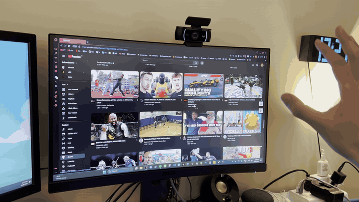
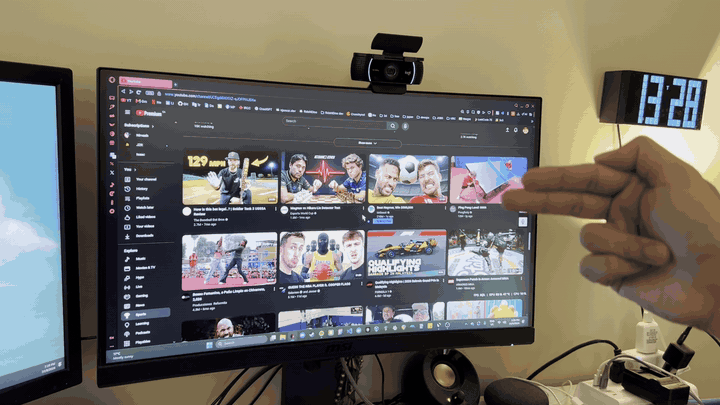
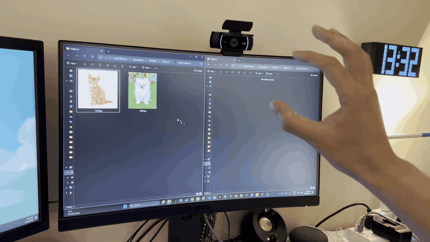
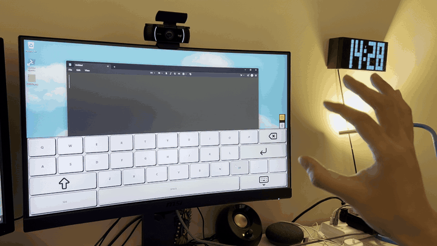
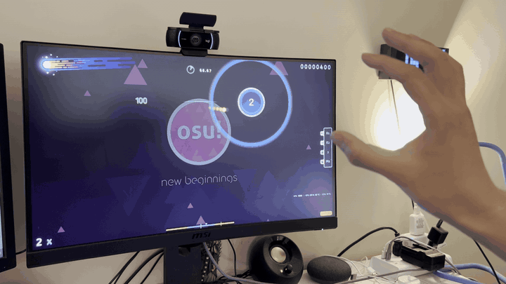

<p align="center">
  
</p>

<p align="center">
  <strong>Motion-based User Navigation &amp; Cursor Handling</strong><br>
  A Windows desktop app that turns your webcam into a mouse.
</p>

<p align="center">
  <a href="https://github.com/kallui/munch/releases/latest"></a>
  <a href="https://github.com/kallui/munch/releases/latest"></a>
  
  
  <a href="LICENSE"></a>
</p>

Control your Windows PC with hand gestures while you’re eating, your hands are dirty, or you just don’t want to touch your mouse and keyboard.

## Showcase

<p align="center">
  <br>
  Pinch to click.
</p>

<p align="center">
  <br>
  Finger gun to scroll.
</p>

<p align="center">
  <br>
  Hold the pinch to drag.
</p>

<p align="center">
  <br>
  Type using the on screen keyboard.
</p>

<p align="center">
  <br>
  Play games...?
</p>

## Download

1. Download **`MUNCH-Setup-<version>.exe`** from the [latest release](https://github.com/kallui/munch/releases/latest).
2. Run it. Windows may say *"Windows protected your PC"*, because the installer isn't code-signed. Click **More info**, then **Run anyway**.
3. Open MUNCH from the Start Menu.

You need Windows 10 or 11 (64-bit) and a webcam. A microphone is optional, for dictation. The installer doesn't ask for admin rights, and you can uninstall from **Settings → Apps** like any other app.

## Quick start

1. Click **Enable MUNCH**. The camera stays off until you do.
2. Hold an open palm, fingers spread, for about two seconds. Status moves from `STANDBY` to `ACTIVE`.
3. Move your hand to move the cursor. Pinch to click. Drop your hand out of frame to disarm.

The info button in the window lists the live gesture map. Settings is where you rebind clicks, pick a camera or mic, and calibrate how far your hand has to travel.

## Features

- **Hands-off mouse.** Palm position drives the cursor. Pinches click, hold to drag, and a finger gun scrolls.
- **Won't click while you eat.** MUNCH ignores your hand until you deliberately arm it, and disarms as soon as the hand leaves the frame.
- **On-screen keyboard.** A large bottom-docked keyboard you can pinch-type into whatever app is focused. It only appears while MUNCH is armed.
- **Dictation.** Tap the mic on the side dock and talk. A live caption shows the words as they're heard, and when you stop (or go quiet for a few seconds) the transcript is typed into the focused window. Speech recognition runs locally.
- **Fits your reach.** Calibrate the motion boundary so a comfortable sweep of your hand covers the whole screen, whatever the camera angle.
- **Live preview.** The window shows the tracked hand, and an optional marker follows the real cursor while a gesture is active.

## Gestures

One hand at a time. Pinch bindings below are the defaults; any pinch can be swapped onto any click in Settings. Scroll and the wake pose stay fixed.

<p align="center">
  
</p>

| Gesture | Default action |
| --- | --- |
| Open palm, fingers spread, hold ~2s | Arm. Until this finishes, the hand is ignored. |
| Move your hand | Cursor follows the palm. |
| Thumb + index pinch | Left click. Hold to drag. |
| Thumb + middle pinch | Right click. Hold to right-drag. |
| Thumb + ring pinch | Double-click. |
| Thumb + pinky pinch | Middle click. Hold to middle-drag. |
| Finger gun | Scroll. Tilt up or down. |
| Hand leaves the frame | Disarm. |

A short pinch is a click. Holding a pinch for about half a second presses the button and drags until you release. Double-click does not drag.

## How it works

Each camera frame goes through four steps:

1. **Capture.** OpenCV reads the webcam, mirrored so the preview matches your hand.
2. **Track.** MediaPipe's Hand Landmarker returns 21 points for a single hand.
3. **Recognize.** A small state machine decides, in order: wake pose, pinch, scroll, or plain movement. Gestures are debounced so a hand entering the frame doesn't fire a stray click.
4. **Act.** pynput moves the system cursor, clicks, and types into the window that currently has focus. The on-screen keyboard and dictation overlays are built so they don't steal that focus.

## Tech stack

| | |
| --- | --- |
| UI | Python, Tkinter, Pillow. Panels and buttons are drawn, because Windows doesn't restyle native sliders and menus. |
| Vision | OpenCV, MediaPipe Hand Landmarker (`munch/models/hand_landmarker.task`) |
| Input | pynput |
| Dictation | faster-whisper, sounddevice |
| Windows | pywin32, for always-on-top overlays that stay out of the way |

## Development

To run from source you need Python 3.12:

```powershell
git clone https://github.com/kallui/munch.git
cd munch
python -m venv .venv
.venv\Scripts\activate
pip install -r requirements.txt
python main.py
```

User settings (`settings.json`, `bindings.json`, `tuning.json`, `calibration.json`) live in `%APPDATA%\MUNCH`, shared by the installed app and a source checkout.

### Building the installer

```powershell
pip install pyinstaller
pyinstaller munch.spec
& "$env:LOCALAPPDATA\Programs\Inno Setup 6\ISCC.exe" installer.iss
```

PyInstaller builds the app folder, `dist\MUNCH\` with `MUNCH.exe` inside. [Inno Setup](https://jrsoftware.org/isinfo.php) (`winget install JRSoftware.InnoSetup`) packages that folder into `dist\MUNCH-Setup-<version>.exe`. The version number lives in `munch/version.py`; the app shows it in Settings and the installer reads it from there.

To ship an update, bump the version, rebuild both, and attach the new installer to a new GitHub release. Running it over an existing install upgrades in place and keeps the user's settings.

## Privacy

Hand tracking runs on your machine with the model shipped in the repo. The webcam is opened only while MUNCH is enabled or a calibration is in progress, and it is released again as soon as you disable it.

Dictation uses the `base.en` Whisper model (about 150 MB). It downloads once, the first time you use the mic, with its progress shown next to the mic button. Later transcriptions stay offline. Gesture tracking and speech recognition both stay on the machine.

## Contributing

Issues and pull requests are welcome at [github.com/kallui/munch](https://github.com/kallui/munch).

If something breaks, `munch_errors.log` and `munch_crash.log` in `%APPDATA%\MUNCH` are worth attaching to an issue.

## License

MUNCH is released under the [MIT License](LICENSE). It bundles open-source components under their own licenses, listed in [`THIRD_PARTY_NOTICES.md`](THIRD_PARTY_NOTICES.md). UI icons are [Tabler Icons](https://tabler.io/icons) by Paweł Kuna, MIT License.
